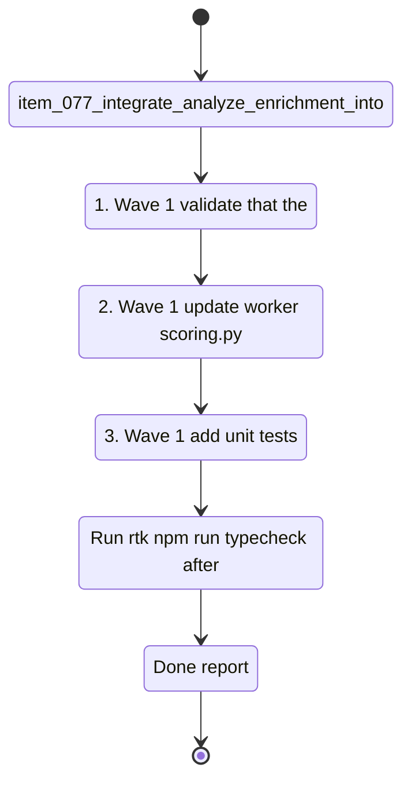

## task_041_orchestrate_post_v1_3_consolidation_enrichment_ci_and_configuration_portability - Orchestrate post-v1.3 consolidation: enrichment loop, CI, and configuration portability

> From version: 1.3.0
> Schema version: 1.0
> Status: Done
> Understanding: 99%
> Confidence: 97%
> Progress: 100%
> Complexity: High
> Theme: Quality / Operational / Product
> Reminder: Update status/understanding/confidence/progress and linked request/backlog references when you edit this doc.

# Context

- Orchestrate the three bounded items from `req_019_post_v1_3_consolidation_enrichment_loop_ci_and_configuration_portability`.
- The goal is to close the open loop between the `analyze` pipeline and Bishop retrieval quality, establish automated CI protection on every PR, and let operators export and import their full configuration without friction.
- These three items are largely independent and can be delivered in any order — the wave map below sequences them from highest product impact to lowest delivery risk.

## Wave map

- Wave 1: Integrate analyze enrichment fields into Bishop retrieval scoring (`item_077`)
  - Goal: update `worker/scoring.py` to factor in AI keywords, AI summary, and confidence score when available; keep the static weight fallback for unenriched documents; add unit tests for enriched vs unenriched ranking.
  - Expected outputs: updated `worker/scoring.py`, enriched scoring path, three-case unit tests, passing evaluate gate.
- Wave 2: Add GitHub Actions CI workflow (`item_078`)
  - Goal: create a workflow that runs separate `frontend`, `worker`, and `contracts` smoke jobs on every push to `main` and every open PR, with hermetic evaluate coverage and an anti-zombie migration guard.
  - Expected outputs: `.github/workflows/ci.yml`, hermetic evaluate step, cached Playwright browser, `frontend`/`worker`/`contracts` job split, anti-zombie check, passing first run.
- Wave 3: Add configuration export and import to the Settings panel (`item_079`)
  - Goal: deliver an "Export configuration" button that downloads a local JSON file and an "Import configuration" button that validates and applies an imported file after explicit user confirmation; display a plaintext warning on export.
  - Expected outputs: export/import UI in Settings, schema validation on import, warning banner, unit tests for export shape and import failure path.

# Plan

- [x] 1. Wave 1 — validate that the `confidence` field and enriched keywords/summary are stable and present in a published analyzed corpus before modifying scoring.
- [x] 2. Wave 1 — update `worker/scoring.py` to incorporate enriched fields when available; document the new weight logic inline; keep a clean fallback to static weights for unenriched documents.
- [x] 3. Wave 1 — add unit tests covering: unenriched document, document with high confidence, document with low confidence — confirm all three produce explainable differential ranks in `worker/tests/test_scoring.py`.
- [x] 4. Wave 1 — run `rtk npm run evaluate` to confirm the quality gate still passes after the scoring change.
- [x] CHECKPOINT: leave Wave 1 commit-ready and run `rtk python3 -m pytest worker/tests/test_scoring.py` and `rtk npm run evaluate` before continuing.
- [x] 5. Wave 2 — create `.github/workflows/ci.yml` with a `frontend` job (`rtk npm run typecheck`, `rtk npm run check`, build), a `worker` job (`pip install -r worker/requirements.txt`, `rtk python3 -m pytest worker/tests -q`), and a `contracts` smoke job that starts the worker and validates `/api/health` plus `/api/config/mode`.
- [x] 6. Wave 2 — keep CI hermetic: evaluate runs in mock mode with no ambient provider keys and no live corpus files; cache the Playwright browser download to keep CI run times reasonable; keep E2E as optional/separate if runner capacity supports it.
- [x] 7. Wave 2 — add an anti-zombie migration guard so CI can fail when runtime-active code still references legacy modules that a closed migration wave should have removed.
- [x] 8. Wave 2 — confirm the workflow passes on a clean branch with no local environment variables set.
- [x] CHECKPOINT: leave Wave 2 commit-ready; verify the Actions run passes on GitHub before continuing.
- [x] 9. Wave 3 — implement the "Export configuration" button in the Settings panel; confirm the downloaded JSON contains all persisted parameters and is generated entirely client-side.
- [x] 10. Wave 3 — implement the "Import configuration" button with schema validation, explicit user confirmation dialog, and full overwrite only on confirmed valid import.
- [x] 11. Wave 3 — add a visible plaintext warning on the export UI.
- [x] 12. Wave 3 — add unit tests covering the export shape and the import validation failure path (malformed file → clear error, no partial write).
- [x] CHECKPOINT: leave Wave 3 commit-ready and run `rtk npm run test -- tests/settings-panel.spec.tsx` and `rtk npm run check` before continuing.
- [x] GATE: do not close a wave until the relevant automated tests and linked docs are updated.
- [x] FINAL: update request, backlog, and task docs once all waves are closed.

# Delivery checkpoints

- After Wave 1: `worker/scoring.py` uses enriched fields when present; static fallback is in place; three-case unit tests pass; evaluate gate passes.
- After Wave 2: GitHub Actions CI is active; every PR is gated; hermetic evaluate runs cleanly without provider keys; separate `frontend`, `worker`, and `contracts` jobs make failures attributable.
- After Wave 3: operators can export and import their full configuration from Settings; schema validation and the plaintext warning are in place; unit tests cover the failure path.

# AC Traceability

- AC1 (req_019) → Wave 1. Bishop scoring uses enriched fields from `analyze`. Proof: updated `worker/scoring.py` and differential rank tests.
- AC2 (req_019) → Wave 1. AI keywords and summary indexed in scoring path after publish. Proof: enrichment integration and static fallback test.
- AC3 (req_019) → Wave 1. Unit tests cover the three-document confidence ranking cases. Proof: test file and results.
- AC4 (req_019) → Wave 2. GitHub Actions workflow active on `main` and open PRs; failure blocks merge. Proof: passing Actions run.
- AC5 (req_019) → Wave 2. CI is hermetic: no ambient keys, no live corpus, no unintended artifacts. Proof: workflow env config and clean run on a fresh branch.
- AC5a (item_078) -> Wave 2. Separate `frontend`, `worker`, and `contracts` jobs exist and validate their own surfaces. Proof: Actions graph and logs.
- AC5b (item_078) -> Wave 2. The worker smoke contract validates `/api/health` and `/api/config/mode` in CI. Proof: contracts job output.
- AC5c (item_078) -> Wave 2. CI can fail on migration anti-zombie violations once a runtime wave is expected to have removed legacy modules. Proof: guard script/config.
- AC6 (req_019) → Wave 3. "Export configuration" downloads a local JSON file with all persisted parameters. Proof: UI and file content inspection.
- AC7 (req_019) → Wave 3. "Import configuration" applies values only after schema validation and explicit confirmation. Proof: UI flow and unit tests.
- AC8 (req_019) → Wave 3. Plaintext secret warning is visible on export. Proof: UI inspection.

# Decision framing

- Product framing: Required for Wave 1 (enrichment loop closing is a product quality signal).
- Product signals: retrieval quality, Bishop answer grounding, operator trust, team usability
- Product follow-up: Re-assess whether a per-document enrichment quality indicator should be surfaced in the Artifacts panel after Wave 1 lands.
- Architecture framing: Required for Wave 1 if the scoring contract changes; lightly required for Wave 2 because CI now validates both frontend and worker contracts.
- Architecture signals: scoring contract in `worker/scoring.py`, enrichment field availability in published corpus, worker smoke contract, migration anti-zombie enforcement
- Architecture follow-up: Create or update an ADR for the scoring change if the enrichment integration modifies the public retrieval contract.

# Links

- Request(s): `logics/request/req_019_post_v1_3_consolidation_enrichment_loop_ci_and_configuration_portability.md`
- Backlog item(s): `item_077_integrate_analyze_enrichment_into_bishop_scoring`, `item_078_add_github_actions_ci_workflow`, `item_079_add_configuration_export_and_import_to_settings`
- Architecture decision(s): `adr_014_deepvault_retrieval_ranking_quality_and_cost_policy`, `adr_029_bound_post_ingest_analysis_contract_and_runtime_output`, `adr_016_deepvault_persistence_and_storage_layout`, `adr_032_integrate_analyze_enrichment_fields_into_bishop_retrieval_scoring`
- Product brief(s): `logics/product/prod_010_add_a_post_ingest_ai_analysis_command_for_corpus_enrichment.md`, `logics/product/prod_013_make_application_configuration_exportable_and_importable.md`

# AI Context

- Summary: Orchestrate the three-wave post-v1.3 consolidation — close the analyze enrichment loop into Bishop scoring, add GitHub Actions CI, and deliver configuration export/import in Settings.
- Keywords: enrichment, analyze pipeline, bishop scoring, retrieval quality, github actions, ci, worker smoke tests, anti-zombie guard, configuration export, import, settings, portability
- Use when: Use when executing the consolidation and operational robustness waves from req_019.
- Skip when: Skip when the work targets structural cleanup or security hardening covered by task_040.

# Validation

- Run `rtk npm run typecheck` after every code-bearing wave.
- Run `rtk python3 -m pytest worker/tests/test_scoring.py` and `rtk npm run evaluate` after Wave 1.
- Verify GitHub Actions run passes on a clean branch after Wave 2.
- Verify the Wave 2 CI graph shows independent `frontend`, `worker`, and `contracts` jobs.
- Run `rtk npm run test -- tests/settings-panel.spec.tsx` and `rtk npm run check` after Wave 3.

# Definition of Done (DoD)

- [x] All three backlog items implemented and acceptance criteria covered.
- [x] Validation commands executed and results captured per wave.
- [x] No wave closed before the relevant automated tests passed.
- [x] Linked request, backlog, and task docs updated during completed waves and at closure.
- [x] Each completed wave left a commit-ready checkpoint.
- [x] Status moved to `Done` and progress to `100%`.

# Delivery update

- Wave 1 is complete. Published analyzed corpora already preserve the additive `analysis` block, and the scoring path now consumes fresh enrichment fields without breaking the static fallback for unenriched documents.
- The main technical fix in this wave was contract alignment: analyze writes confidence on a `55..95` scale, while the worker scoring threshold is ratio-based. `worker/scoring.py` now normalizes both `55..95` and legacy `0..1` confidence payloads before deciding whether to trust enrichment and how much bonus to apply.
- Validation completed for Wave 1 with `rtk python3 -m pytest worker/tests/test_scoring.py -q`, `rtk npm run typecheck`, and `rtk npm run evaluate` (100% pass rate, quality gate pass on 20 mock queries).
- Wave 2 implementation is now landed locally: `.github/workflows/ci.yml` is split into `frontend`, `worker`, and `contracts` jobs, hermetic evaluate output is redirected outside the repo tree, the worker HTTP smoke check is scripted, and an anti-zombie migration guard protects the browser runtime boundary.
- Local Wave 2 validation completed with `rtk npm run ci:anti-zombie`, `rtk npm run typecheck`, `DEEPVAULT_CHECK_SKIP_E2E=1 DEEPVAULT_CHECK_SKIP_EVALUATE=1 rtk npm run check`, `rtk python3 -m pytest worker/tests -q`, and `rtk python3 scripts/worker-contract-smoke.py`.
- Wave 2 is now fully closed. After the initial failing run `24609048677`, a follow-up fix made worker job-metadata writes atomic and the next GitHub Actions run `24609268556` passed cleanly on `main` with `frontend`, `worker`, and `contracts` green.
- Wave 3 is now complete. Settings can export a full browser-side configuration snapshot as JSON, import it back through schema validation plus explicit confirmation, and warn clearly that exported files contain plaintext secrets.
- Wave 3 validation completed with `rtk npm run test -- tests/settings-panel.spec.tsx`, `rtk npm run typecheck`, `DEEPVAULT_CHECK_SKIP_E2E=1 DEEPVAULT_CHECK_SKIP_EVALUATE=1 rtk npm run check`, and a separate `rtk npm run evaluate` rerun.
- Full local `rtk npm run check` still hits sandbox limits on E2E preview port binding and sandboxed `tsx` IPC; the remote GitHub Actions pass on run `24609268556` provides the final clean validation for this task.
