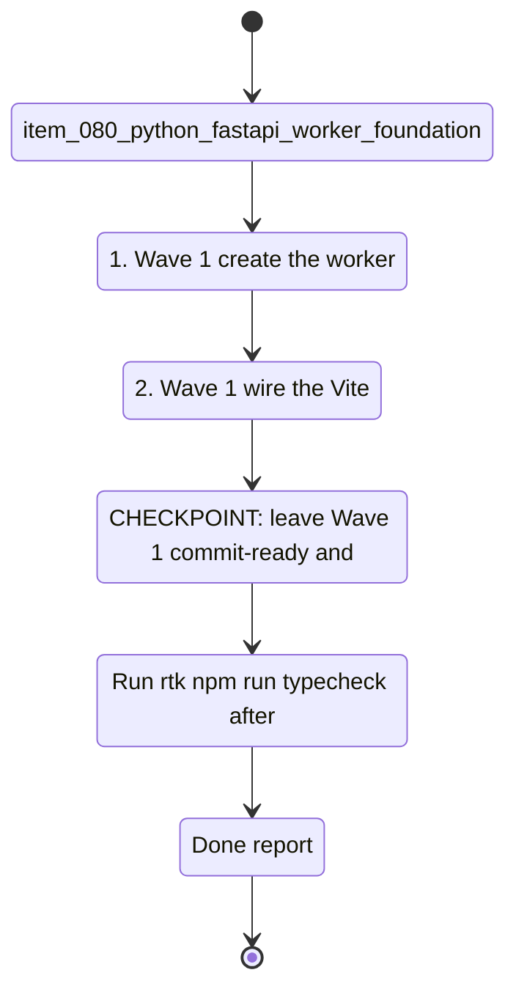

## task_042_orchestrate_python_worker_foundation_and_runtime_migration - Orchestrate Python worker foundation and runtime migration

> From version: 1.4.0
> Schema version: 1.0
> Status: In Progress
> Understanding: 100%
> Confidence: 99%
> Progress: 86%
> Complexity: High
> Theme: Architecture / Infrastructure
> Reminder: Update status/understanding/confidence/progress and linked request/backlog references when you edit this doc.

# Context

- Orchestrate the runtime migration slice of `req_020_host_nexus_as_a_shared_multi_user_web_application`.
- The goal is to establish the Python FastAPI worker as the single backend runtime, move scoring and Bishop orchestration out of the browser, expose the shared corpus over HTTP, and bring job execution onto the worker.
- The backend capabilities introduced by this task must remain operable through both the HTTP API and a thin first-party CLI over the same Python services.
- This task covers the technical foundation needed before the hosted auth and deployment wave can close.
- Keep the delivery wave-shaped and commit-ready: foundation first, then pure-function migration, then browser/worker contract changes, then job execution.
- Use the agreed first-wave worker conventions from the start: structured `worker/app/` and `worker/cli/`, file-backed runtime artifacts under `data/runtime/`, canonical job statuses, stable `config/mode` payload, stable error envelope, and no long-lived duplicate legacy runtime path.
- Use the agreed implementation conventions from the start as well: `workerVersion` from a single worker-owned version source, ISO 8601 UTC timestamps, UUID v4 job ids, and simple keep-by-default retention for persisted job event logs until a later cleanup policy is defined.

## Wave map

- Wave 1: Python worker foundation (`item_080`)
  - Goal: create the FastAPI app skeleton, health/config endpoints, minimal CLI scaffold, dependency manifest, Dockerfile, and local dev proxy contract.
  - Expected outputs: `worker/` package, `GET /api/health`, `GET /api/config/mode`, `worker health`, `worker config-mode`, pinned dependencies, Vite `/api` proxy, local setup docs.
- Wave 2: scoring migration to Python (`item_081`)
  - Goal: port document ranking and enrichment scoring to `worker/scoring.py` with parity tests against the TypeScript contract.
  - Expected outputs: Python scoring module, enriched vs unenriched rank coverage, documented weighting behavior.
- Wave 3: corpus endpoint and browser bundle cleanup (`item_082`)
  - Goal: move corpus loading to `GET /api/corpus`, keep corpus inspection/debug accessible via CLI, remove browser-side corpus/scoring/Graph modules from the production path, and expose the explicit offline state.
  - Expected outputs: worker corpus endpoint, `ETag` handling, browser fetch path, `worker corpus show|validate`, bundle cleanup, offline error state.
- Wave 4: Bishop proxy endpoint (`item_083`)
  - Goal: move Bishop orchestration and provider calls to `POST /api/bishop/query` on the worker, keep a CLI debug path over the same service, and update the browser to use the proxy.
  - Expected outputs: `worker/bishop.py`, browser proxy client path, `worker bishop query --question "..."`, integration coverage, no browser-side API keys.
- Wave 5: job execution on the Python worker (`item_084`)
  - Goal: replace Node.js CLI execution with worker-managed jobs and SSE progress streaming while preserving first-party CLI operability over the same services.
  - Expected outputs: `POST /api/jobs`, job status/events endpoints, `worker jobs run ...`, `worker jobs status ...`, persisted runtime artifacts, Sync panel integration.

# Plan

- [x] 1. Wave 1 — create the `worker/` FastAPI foundation (`main.py`, `config.py`, requirements, Dockerfile) and expose `GET /api/health` plus `GET /api/config/mode`.
- [x] 1b. Wave 1 — add a minimal CLI entrypoint over the shared worker services and ship `worker health` plus `worker config-mode`.
- [x] 1a. Wave 1 — pin the initial worker stack to `fastapi`, `uvicorn[standard]`, `httpx`, `pydantic-settings`, `python-jose[cryptography]`, `sse-starlette`, `pytest`, and `pytest-asyncio`, and use `worker/tests/` as the canonical Python test tree.
- [x] 1c. Wave 1 — lay out the worker with `app/routes`, `app/services`, `app/auth`, `app/infra`, `cli/commands`, and `tests`; keep business logic out of routes and commands.
- [x] 1d. Wave 1 — lock the first-wave contracts for `GET /api/config/mode` and the standard worker JSON error envelope.
- [x] 1e. Wave 1 — source `workerVersion` from a single worker-owned version file and standardize ISO 8601 UTC timestamps in worker contracts.
- [x] 2. Wave 1 — wire the Vite dev proxy (`/api -> localhost:8000`) and document the local dev workflow (`uvicorn` or Docker Compose alongside `npm run dev`).
- [ ] CHECKPOINT: leave Wave 1 commit-ready and verify the worker responds through both direct curl and the Vite proxy path.
- [x] 3. Wave 2 — port the document scoring contract to `worker/scoring.py`, including enrichment scoring from `adr_032`.
- [x] 3a. Wave 2 — implement functional parity with the TypeScript scoring contract rather than bit-perfect parity, and freeze the first-wave enrichment tuning at confidence threshold `0.7` with a bounded score bonus capped at `+15%`.
- [x] 4. Wave 2 — add Python unit tests covering unenriched, high-confidence, and low-confidence ranking cases; confirm parity with the existing TypeScript contract before deletion.
- [x] CHECKPOINT: leave Wave 2 commit-ready and run focused worker scoring tests plus the evaluate gate.
- [x] 5. Wave 3 — implement `GET /api/corpus` with `ETag` support and local-mode mock corpus serving from the worker.
- [x] 5a. Wave 3 — expose `worker corpus show` and `worker corpus validate` over the same corpus service used by `GET /api/corpus`.
- [ ] 6. Wave 3 — move the browser corpus loading path to the worker endpoint, remove browser references to `src/data/corpus.ts`, `src/lib/scoring.ts`, and `src/lib/deepvault.ts`, and ship the explicit offline error state.
- [ ] CHECKPOINT: leave Wave 3 commit-ready and verify the browser fetch path plus bundle cleanup.
- [x] 7. Wave 4 — implement `POST /api/bishop/query` in `worker/bishop.py`, including grounding, prompt assembly, provider dispatch, and structured response parity with `adr_020`.
- [x] 7a. Wave 4 — expose a CLI debug path (`worker bishop query --question "..."`) over the same Bishop service used by the HTTP endpoint.
- [ ] 8. Wave 4 — update the browser Bishop flow to call the worker proxy and confirm no provider API key remains in the browser path.
- [ ] CHECKPOINT: leave Wave 4 commit-ready and run integration coverage for success, low-confidence, and provider-error paths.
- [x] 9. Wave 5 — implement `POST /api/jobs`, `GET /api/jobs/:id`, and `GET /api/jobs/:id/events` with persisted runtime state and SSE progress.
- [x] 9a. Wave 5 — expose `worker jobs run ingest|analyze|evaluate|export-live` and `worker jobs status <id>` over the same job service layer used by the HTTP routes.
- [x] 9b. Wave 5 — persist canonical job metadata in `data/runtime/jobs/<jobId>.json` and append events in `data/runtime/jobs/<jobId>.events.jsonl` using the statuses `queued`, `running`, `succeeded`, `failed`, and `cancelled`.
- [x] 9c. Wave 5 — use UUID v4 job ids and keep the persisted job metadata/event log retention simple by default until an explicit cleanup policy is introduced.
- [ ] 10. Wave 5 — update the Sync panel to trigger worker-managed jobs and render real-time progress from the SSE stream.
- [ ] GATE: when a wave replaces a legacy browser/Node runtime path, remove or fully disconnect the replaced path before closing the wave.
- [ ] GATE: do not close a wave until the relevant automated tests and linked docs are updated.
- [ ] FINAL: update request, backlog, architecture, and task docs once all runtime migration waves are closed.

# Delivery checkpoints

- After Wave 1: the Python FastAPI worker exists, is runnable locally, and exposes `/api/health` plus `/api/config/mode`.
- After Wave 1: the Python FastAPI worker exists, is runnable locally, and exposes `/api/health`, `/api/config/mode`, `worker health`, and `worker config-mode`.
- After Wave 1: the Python FastAPI worker exists with the agreed folder layout, stable runtime projection, and standard error envelope.
- After Wave 2: scoring runs in Python with test coverage for enriched and unenriched ranking behavior.
- After Wave 3: the browser fetches corpus data from `/api/corpus`; no corpus/scoring/Graph logic remains on the browser path.
- After Wave 4: the browser calls `/api/bishop/query`; Bishop orchestration and provider access are worker-owned.
- After Wave 5: jobs run on the worker with status polling, SSE progress, and persisted runtime artifacts.
- After Wave 5: jobs run on the worker with status polling, SSE progress, persisted runtime artifacts, and equivalent CLI invocation paths.

# AC Traceability

- AC1 (item_080) -> Wave 1. Foundation endpoints, minimal CLI, and worker packaging exist. Proof: `/api/health`, `/api/config/mode`, `worker health`, `worker config-mode`, requirements, Dockerfile, local dev docs.
- AC2 (item_081) -> Wave 2. Scoring runs in `worker/scoring.py` with enrichment-aware ranking. Proof: Python tests and parity checks.
- AC3 (item_082) -> Wave 3. The browser fetches corpus from `/api/corpus`, corpus inspection remains CLI-accessible, and no longer relies on bundled corpus/scoring/Graph modules. Proof: fetch path, `worker corpus ...`, bundle inspection, offline-state behavior.
- AC4 (item_083) -> Wave 4. Bishop queries are served by the worker proxy and browser-side provider logic is removed, with CLI debug parity over the same service. Proof: integration tests, `worker bishop query ...`, and network inspection.
- AC5 (item_084) -> Wave 5. Job execution is worker-managed with status/events and persisted results, while CLI job control remains available over the same service layer. Proof: job API behavior, `worker jobs ...`, SSE progress, Sync panel integration.

# Decision framing

- Product framing: Not primary, but browser/worker contract changes affect operator expectations and must remain explicit.
- Product signals: shared corpus consistency, Bishop answer parity, Sync progress continuity
- Product follow-up: confirm whether any browser-side UX copy must change once corpus/Bishop become fully worker-owned.
- Architecture framing: Required
- Architecture signals: worker runtime boundary, agreed dependency stack, functional scoring parity, enrichment threshold/bonus, corpus transport, Bishop response contract, SSE job orchestration, API/CLI parity over shared services
- Architecture signals: worker runtime boundary, agreed dependency stack, functional scoring parity, enrichment threshold/bonus, corpus transport, Bishop response contract, SSE job orchestration, API/CLI parity over shared services, canonical runtime file layout, stable error/config contracts, anti-zombie migration gate
- Architecture follow-up: keep `adr_034` and `adr_035` synchronized as the migration lands.

# Links

- Request(s): `logics/request/req_020_host_nexus_as_a_shared_multi_user_web_application.md`
- Backlog item(s): `item_080_python_fastapi_worker_foundation`, `item_081_port_scoring_to_python_worker`, `item_082_corpus_endpoint_and_browser_bundle_cleanup`, `item_083_bishop_proxy_endpoint`, `item_084_job_execution_in_python_worker`
- Architecture decision(s): `adr_020_clarify_bishop_orchestration_states_and_response_contract`, `adr_023_split_execution_runtime_from_the_app_and_share_corpus_artifacts`, `adr_032_integrate_analyze_enrichment_fields_into_bishop_retrieval_scoring`, `adr_034_nexus_hosted_deployment_topology_and_multi_user_access_model`, `adr_035_python_fastapi_as_the_worker_runtime`
- Product brief(s): `logics/product/prod_014_host_nexus_as_a_shared_multi_user_web_application.md`

# AI Context

- Summary: Orchestrate the Python FastAPI worker foundation and the migration of runtime logic out of the browser.
- Keywords: fastapi, worker, cli parity, scoring, corpus endpoint, bishop proxy, jobs, sse, runtime migration
- Use when: Use when planning or executing the technical migration from browser/CLI logic to the shared Python worker.
- Skip when: Skip when the work is primarily about hosted auth, access control, or deployment packaging.

# Validation

- Run `rtk npm run typecheck` after every code-bearing wave that changes browser contracts.
- Run focused Python tests (`rtk python3 -m pytest worker/tests/...`) after Waves 2, 4, and 5.
- Run focused CLI smoke checks (`rtk python3 -m worker.cli.main ...` or equivalent entrypoint) after Waves 1, 3, 4, and 5.
- Run `rtk npm run evaluate` after scoring migration and before removing the TypeScript path.
- Run `rtk npm run check` before closing Waves 3 through 5.
- Run `rtk python3 logics/skills/logics-doc-linter/scripts/logics_lint.py --require-status --format text` after updating linked Logics docs.

# Definition of Done (DoD)

- [ ] All five backlog items implemented and acceptance criteria covered.
- [ ] Validation commands executed and results captured per wave.
- [ ] No wave closed before the relevant automated tests passed.
- [ ] Linked request, backlog, product, architecture, and task docs updated during completed waves and at closure.
- [ ] Each completed wave left a commit-ready checkpoint.
- [ ] CLI and HTTP surfaces both exercise the same worker services for the capabilities introduced by the task.
- [ ] Replaced legacy browser/Node runtime paths are removed or disconnected before the closing wave is marked complete.
- [ ] Status moved to `Done` and progress to `100%`.

## Progress notes

- Wave 1 implementation is in progress on top of `1.4.0`: the Python worker skeleton now exists with shared services, foundation routes, CLI parity for health/config mode, pinned dependencies, Dockerfile, tests, and Vite proxy wiring.
- Wave 2 is now complete: the worker has a Python scoring module with enrichment-aware ranking, worker-side tests, a TypeScript spot-check on the static path, and a passing evaluate gate.
- Wave 3 is in progress: the worker corpus service, `GET /api/corpus`, CLI corpus inspection, frontend `/api/corpus` fetch path, and `ETag` reuse are now landed.
- `src/data/corpus.ts` is now removed and callers use the new corpus client / mock corpus split instead of the old mixed browser helper.
- Wave 4 is now materially advanced: the worker exposes the Bishop proxy plus matching CLI command, the browser uses `/api/bishop/query` by default, and the worker performs server-side dispatch for OpenAI, Gemini, and Anthropic.
- Wave 4 is now complete: the worker-backed Bishop proxy, CLI parity, browser proxy path, provider-dispatch tests, and final browser-side legacy module retirement are all landed and validated.
- The active browser Bishop runtime now goes through a dedicated HTTP client instead of importing `src/lib/bishop.ts`, while keeping a thin local fallback path to avoid regressions during migration.
- Browser-safe modules now consume a dedicated `runtime-types` boundary instead of importing shared types through `deepvault.ts`, reducing the browser dependency footprint on legacy business-logic modules.
- The app model now uses browser-safe corpus view helpers from `corpus-view.ts` instead of pulling those view helpers from `deepvault.ts`.
- The local Bishop fallback path is now isolated in `src/lib/corpus-grounding.ts`, removing the final browser-runtime value import of `deepvault.ts` while keeping Node-side tests and scripts compatible through re-exports.
- The `live` corpus path now stays worker-backed even when `/api/corpus` is missing or the worker is offline: the app shows an explicit empty/error state plus reconnect guidance instead of silently switching back to mock data.
- Browser-safe ranking now flows through `src/lib/corpus-ranking.ts`, leaving `src/lib/scoring.ts` as a compatibility wrapper for non-browser imports and shrinking the remaining legacy browser dependency surface.
- Focused Playwright coverage now verifies the live-mode worker-unreachable state in the browser, which closes the remaining Wave 3 offline verification gap.
- Worker-side Bishop coverage now includes successful provider-dispatched answers and graceful fallback when keys are missing or upstream provider calls fail.
- Explicit non-browser imports now point to `src/lib/bishop-orchestration.ts`, and `src/lib/bishop.ts` has been removed from the codebase.
- Wave 5 has now started with a worker-native job orchestration slice: `POST /api/jobs`, `GET /api/jobs/{id}`, `GET /api/jobs/{id}/events`, canonical runtime persistence, and `worker jobs run|status` are landed over a shared `JobsService`.
- The first worker-native job implementation is `evaluate`, which persists progress events and a structured summary result; `ingest`, `analyze`, and `export-live` still fail explicitly as not implemented, so the Sync panel migration and the remaining pipeline ports stay open.
- The current checkpoint is the rest of Wave 5: port the remaining job types, move the Sync panel to the worker contract, and then close the task once the legacy Node execution path is fully disconnected.
