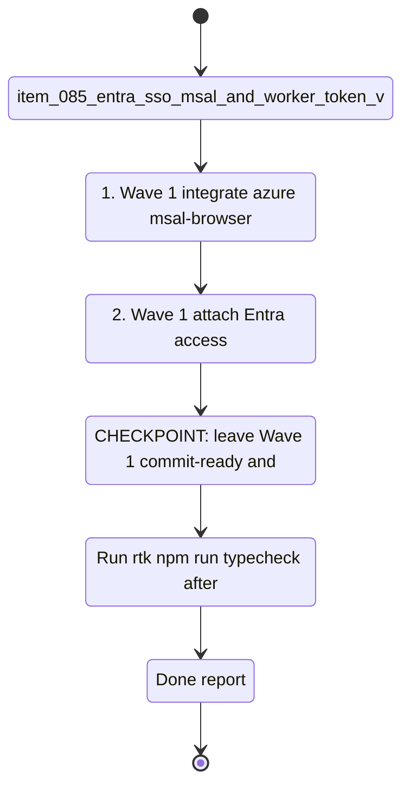

## task_043_orchestrate_hosted_auth_access_and_deployment - Orchestrate hosted auth, access control, and deployment packaging

> From version: 1.3.0
> Schema version: 1.0
> Status: In Progress
> Understanding: 99%
> Confidence: 98%
> Progress: 75%
> Complexity: High
> Theme: Security / Product / Operations
> Reminder: Update status/understanding/confidence/progress and linked request/backlog references when you edit this doc.

# Context

- Orchestrate the hosted-delivery slice of `req_020_host_nexus_as_a_shared_multi_user_web_application`.
- The goal is to secure the shared Nexus deployment with Entra SSO, differentiate team-member and operator access, adapt the browser UI to hosted mode, and package the deployment as an operator-runnable Docker Compose stack.
- This task assumes the worker runtime foundation is in place or advancing in parallel; it focuses on the access and deployment layers above that runtime.
- Keep the wave order pragmatic: auth first, then operator controls and auditability, then browser hosted-mode adaptation, then packaging/runbook.

## Wave map

- Wave 1: Entra SSO and worker token validation (`item_085`)
  - Goal: add MSAL in the browser and JWKS-based token validation in the worker, with local-dev bypass intact.
  - Expected outputs: MSAL flow, bearer-token attachment, worker auth middleware, Entra app registration docs.
- Wave 2: operator allowlist and structured access log (`item_086`)
  - Goal: enforce operator-only endpoints and record validated access in a bounded JSON log with rotation/retention.
  - Expected outputs: `OPERATOR_ALLOWLIST` gate, structured access-log middleware, retention behavior, 401/403 coverage.
- Wave 3: hosted mode UI (`item_087`)
  - Goal: make hosted mode visible and usable in the browser without leaking secrets or showing local-only controls.
  - Expected outputs: identity display, sign-out, `Shared` label, API key inputs hidden, operator-gated panels/buttons.
- Wave 4: Docker Compose deployment package (`item_088`)
  - Goal: provide the concrete deployment package and runbook for operators on Windows with Docker Desktop.
  - Expected outputs: `docker-compose.yml`, `Caddyfile`, `.env.example`, deployment guide, smoke-tested startup/update workflow.

# Plan

- [x] 1. Wave 1 — integrate `@azure/msal-browser` in the React app with silent SSO first and redirect fallback.
- [x] 2. Wave 1 — attach Entra access tokens to worker API requests and implement JWKS-based token validation in `worker/auth.py`, with `WORKER_AUTH_ENABLED=false` preserving local dev behavior.
- [x] 2a. Wave 1 — keep the hosted auth config minimal (`ENTRA_TENANT_ID`, `ENTRA_CLIENT_ID`, `WORKER_AUTH_ENABLED`, `OPERATOR_ALLOWLIST`) and assume HTTPS via the shared Caddy origin for non-localhost hosted URLs.
- [x] CHECKPOINT: leave Wave 1 commit-ready and verify hosted `401` behavior plus local-mode bypass.
- [x] 3. Wave 2 — implement `OPERATOR_ALLOWLIST` enforcement for job-control and artifacts endpoints.
- [x] 4. Wave 2 — add structured JSON access logging with daily rotation and 30-day retention under `data/logs/`.
- [x] CHECKPOINT: leave Wave 2 commit-ready and verify `403` behavior for non-operators plus log emission.
- [x] 5. Wave 3 — read `/api/config/mode` in the browser, render hosted-mode identity affordances, and hide API key inputs in hosted mode.
- [x] 6. Wave 3 — gate Artifacts and Sync job-control UI by a worker-returned operator flag, and prefer not rendering restricted UI at all for non-operators while preserving unchanged local-dev behavior.
- [x] CHECKPOINT: leave Wave 3 commit-ready and verify hosted-vs-local UI parity in focused tests or E2E coverage.
- [ ] 7. Wave 4 — package the stack with `docker-compose.yml`, `Caddyfile`, `.env.example`, and an operator runbook covering install, update, health checks, and operator provisioning.
- [ ] 7a. Wave 4 — standardize the first-wave Windows runtime path on `C:\\deepvault-nexus\\data\\runtime` and keep Caddy as the only documented reverse-proxy path for the hosted package.
- [ ] 8. Wave 4 — smoke-test the Windows Docker Desktop flow: startup, worker restart, persistent runtime data, hosted browser access.
- [ ] GATE: do not close a wave until the relevant automated tests and linked docs are updated.
- [ ] FINAL: update request, backlog, product, architecture, and task docs once the hosted auth/access/deployment waves are closed.

# Delivery checkpoints

- After Wave 1: hosted requests are Entra-authenticated and local development still runs without Entra.
- After Wave 2: operator-only endpoints are enforced and validated requests are logged with bounded retention.
- After Wave 3: the browser clearly distinguishes hosted vs local mode and hides local-only secret inputs in hosted mode.
- After Wave 4: operators have a deployable Docker Compose package and runbook for the hosted stack.

## Progress notes

- Wave 1 is complete. The browser now initializes hosted auth from `/api/config/mode`, performs silent SSO first with MSAL redirect fallback, and forwards bearer tokens to the worker for corpus, bishop, and sync flows.
- The worker now preloads tenant JWKS at startup, validates Entra access tokens locally on protected `/api/*` routes, preserves the `WORKER_AUTH_ENABLED=false` local-dev bypass, and exposes validated identity claims for the next operator-gating wave.
- Validation completed for the auth wave with `rtk python3 -m pytest worker/tests -q` and `rtk npm run check`.
- Wave 2 is complete. Job-control routes now enforce `OPERATOR_ALLOWLIST`, `/api/config/mode` can project `isOperator` from an optional authenticated request, and validated requests emit structured access-log lines under `data/logs/` with 30-day retention cleanup.
- Validation completed for the operator/access-log wave with `rtk python3 -m pytest worker/tests -q` and focused browser regression coverage for hosted auth and sync flows.
- Wave 3 is complete. Hosted mode now shows the authenticated identity in the shell, exposes a sign-out action, renders a subtle `Shared` session card in Settings, hides AI provider key inputs, and removes operator-only navigation and job-control surfaces for non-operators.
- Validation completed for the hosted-mode UI wave with focused Vitest coverage plus a full `rtk npm run check`.

# AC Traceability

- AC1 (item_085) -> Wave 1. Hosted mode is protected by MSAL + JWKS token validation with local-dev bypass preserved. Proof: auth flow behavior and worker validation coverage.
- AC2 (item_086) -> Wave 2. Operator-only endpoints enforce `OPERATOR_ALLOWLIST`, and validated requests emit structured access logs. Proof: `403` tests and log files.
- AC3 (item_087) -> Wave 3. Hosted-mode identity, sign-out, `Shared` label, hidden API key inputs, and operator-gated panels are delivered. Proof: UI behavior in hosted and local modes.
- AC4 (item_088) -> Wave 4. Docker Compose deployment, Caddy proxying, env template, and runbook are present and smoke-tested. Proof: startup/update flow and hosted manual smoke test.

# Decision framing

- Product framing: Required
- Product signals: frictionless access, silent login, operator trust, secret handling, hosted/local clarity
- Product follow-up: check whether hosted mode needs one additional onboarding surface beyond the subtle `Shared` label.
- Architecture framing: Required
- Architecture signals: token validation boundary, minimal auth config surface, HTTPS via Caddy, worker-derived operator state, access-log retention, runtime mode detection, same-origin proxy contract
- Architecture follow-up: keep `prod_014`, `prod_015`, `adr_034`, and `adr_035` synchronized as deployment/auth details harden.

# Links

- Request(s): `logics/request/req_020_host_nexus_as_a_shared_multi_user_web_application.md`
- Backlog item(s): `item_085_entra_sso_msal_and_worker_token_validation`, `item_086_operator_allowlist_and_access_log`, `item_087_hosted_mode_ui`, `item_088_docker_compose_deployment_package`
- Architecture decision(s): `adr_034_nexus_hosted_deployment_topology_and_multi_user_access_model`, `adr_035_python_fastapi_as_the_worker_runtime`, `adr_015_deepvault_security_audit_logging_and_retention_boundaries`
- Product brief(s): `logics/product/prod_014_host_nexus_as_a_shared_multi_user_web_application.md`, `logics/product/prod_015_user_authentication_and_access_management.md`

# AI Context

- Summary: Orchestrate hosted authentication, access control, browser hosted-mode behavior, and deployment packaging for the shared Nexus stack.
- Keywords: entra, msal, jwks, operator allowlist, access log, shared mode, sign-out, docker compose, caddy
- Use when: Use when planning or executing the hosted security, UX, and deployment slices of `req_020`.
- Skip when: Skip when the work is mainly about worker runtime migration or browser-to-worker business-logic extraction.

# Validation

- Run `rtk npm run typecheck` after code-bearing browser waves.
- Run focused Python auth tests (`rtk python3 -m pytest worker/tests/test_auth.py ...`) after Waves 1 and 2.
- Run focused browser tests or E2E coverage for hosted mode UI after Wave 3.
- Run deployment smoke checks and health checks after Wave 4.
- Run `rtk python3 logics/skills/logics-doc-linter/scripts/logics_lint.py --require-status --format text` after updating linked Logics docs.

# Definition of Done (DoD)

- [ ] All four backlog items implemented and acceptance criteria covered.
- [ ] Validation commands executed and results captured per wave.
- [ ] No wave closed before the relevant automated tests passed.
- [ ] Linked request, backlog, product, architecture, and task docs updated during completed waves and at closure.
- [ ] Each completed wave left a commit-ready checkpoint.
- [ ] Status moved to `Done` and progress to `100%`.
