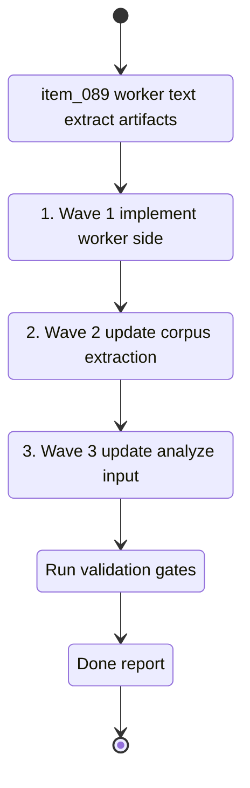

## task_044_orchestrate_extract_backed_analysis_pipeline - Orchestrate extract-backed analysis pipeline

> From version: 1.5.1
> Schema version: 1.0
> Status: Ready
> Understanding: 96%
> Confidence: 93%
> Progress: 0%
> Complexity: High
> Theme: Data / Worker / Analysis
> Reminder: Update status/understanding/confidence/progress and linked request/backlog references when you edit this doc.

# Context

- Orchestrate `req_021_enforce_real_text_extraction_before_post_ingest_analysis`.
- The current pipeline can analyze placeholder corpus content like `Source: ... Path: ...` when the real body text was not extracted.
- The goal is to make extraction quality explicit, persist real plain-text extracts when available, and make the analyze path prefer extract-backed body text over metadata-only fallback.
- Keep the rollout split so extraction artifacts, corpus contract changes, and analysis behavior can each be reviewed and validated independently.

## Wave map

- Wave 1: worker text extract artifacts (`item_089`)
  - Goal: persist normalized plain-text extract artifacts for supported SharePoint documents.
  - Expected outputs: extract artifact writer, source metadata preservation, extraction status/reason, worker tests.
- Wave 2: corpus extract-quality contract (`item_090`)
  - Goal: expose extraction quality in the corpus and user-facing diagnostics.
  - Expected outputs: corpus fields or equivalent metadata, validation coverage, artifact diagnostics, retrieval/Bishop guardrails for metadata-only content.
- Wave 3: analyze consumes extract-backed text (`item_091`)
  - Goal: make provider-backed and local analysis use real extracted body text when available and stay conservative for metadata-only documents.
  - Expected outputs: analyze input selection, reports with extraction-quality counts, full-text vs metadata-only fixtures, analysis tests.

# Plan

- [ ] 1. Wave 1 — implement worker-side extract artifact creation for supported SharePoint files.
- [ ] 2. Wave 1 — preserve Graph source metadata in extract artifacts and classify extraction outcomes.
- [ ] CHECKPOINT: leave Wave 1 commit-ready with worker tests proving successful extraction and metadata-only fallback.
- [ ] 3. Wave 2 — extend the corpus contract with extraction quality metadata and update validation.
- [ ] 4. Wave 2 — surface extraction quality in artifact diagnostics and prevent placeholder text from being treated as body evidence in retrieval/Bishop assembly.
- [ ] CHECKPOINT: leave Wave 2 commit-ready with corpus validation and artifact diagnostics coverage.
- [ ] 5. Wave 3 — update `npm run analyze` and worker-backed analyze to prefer extract-backed text.
- [ ] 6. Wave 3 — add fixtures proving full-text analysis is body-grounded and metadata-only analysis remains conservative.
- [ ] 7. Wave 3 — add analyze report metrics for full-text, partial-text, metadata-only, and unreadable inputs.
- [ ] GATE: do not close a wave until tests and linked Logics docs are updated.
- [ ] FINAL: update request, backlog, task, spec, product, and architecture docs once all extraction-backed analysis waves are closed.

# Delivery checkpoints

- After Wave 1: supported documents can produce durable extract artifacts with traceable metadata.
- After Wave 2: corpus consumers can tell whether a document is full-text, partial, metadata-only, or unreadable.
- After Wave 3: analysis no longer produces substantive summaries from placeholder source/path text.

# AC Traceability

- AC1 (`item_089`) -> Wave 1. Worker writes extract artifacts for supported documents.
- AC2 (`item_090`) -> Wave 2. Corpus documents expose extraction quality and validation accepts the new contract.
- AC3 (`item_091`) -> Wave 3. Analyze uses extract-backed text before corpus placeholder content.
- AC4 (`req_021`) -> Waves 2 and 3. Metadata-only and unreadable states are visible and handled conservatively.
- AC5 (`req_021`) -> Wave 3. Fixtures prove `.docx` or `.pdf` body text produces body-grounded analysis while metadata-only stays flagged.
- AC6 (`req_021`) -> All waves. Tests cover extraction success, fallback, and analysis preference.

# Decision framing

- Product framing: Required
- Product signals: operator trust, answer quality, analysis confidence, metadata-only visibility
- Product follow-up: decide whether metadata-only documents stay in the main Explorer list or get a clearer visual treatment.
- Architecture framing: Required
- Architecture signals: extract artifact boundary, corpus contract versioning, worker ownership, analysis input provenance, retrieval guardrails
- Architecture follow-up: keep `spec_004`, `spec_006`, `adr_016`, and `adr_029` synchronized as extraction status fields harden.

# Links

- Request(s): `logics/request/req_021_enforce_real_text_extraction_before_post_ingest_analysis.md`
- Backlog item(s): `item_089_worker_text_extract_artifacts_for_sharepoint_documents`, `item_090_corpus_contract_for_extract_quality_and_metadata_only_sources`, `item_091_analyze_pipeline_uses_extract_backed_text`
- Product brief(s): `logics/product/prod_006_improve_ingestion_metadata_and_chunking_for_bishop_hints.md`, `logics/product/prod_010_add_a_post_ingest_ai_analysis_command_for_corpus_enrichment.md`
- Architecture decision(s): `logics/architecture/adr_003_hybrid_knowledge_store_and_retrieval_model.md`, `logics/architecture/adr_016_deepvault_persistence_and_storage_layout.md`, `logics/architecture/adr_029_bound_post_ingest_analysis_contract_and_runtime_output.md`
- Spec(s): `logics/specs/spec_004_deepvault_data_schema_and_storage_contracts.md`, `logics/specs/spec_006_deepvault_prompt_and_context_assembly.md`

# AI Context

- Summary: Orchestrate the extract-backed analysis pipeline so worker extraction artifacts, corpus extraction quality, and analyze input selection land as reviewable waves.
- Keywords: extraction, extracts, metadata-only, analyze, corpus contract, worker, SharePoint, docx, pdf
- Use when: Use when implementing or coordinating `req_021` and its three backlog items.
- Skip when: Skip for unrelated artifacts UI cleanup or provider-only analysis tuning.

# Validation

- Run focused worker tests after Wave 1.
- Run corpus validation and artifact diagnostics tests after Wave 2.
- Run analyze pipeline tests after Wave 3.
- Run `rtk npm run typecheck` after TypeScript contract changes.
- Run `rtk python -m logics_manager lint --require-status` after linked Logics docs change.

# Definition of Done (DoD)

- [ ] All three backlog items implemented and acceptance criteria covered.
- [ ] Validation commands executed and results captured per wave.
- [ ] Linked request, backlog, product, architecture, spec, and task docs updated.
- [ ] Each completed wave left a commit-ready checkpoint.
- [ ] Status moved to `Done` and progress to `100%`.
